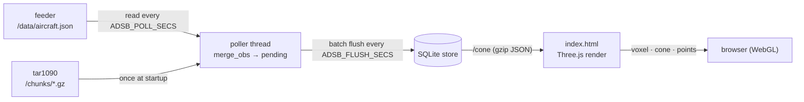

# ADSb-Vue — how it works

A walkthrough of the internals for someone comfortable with Python who wants to
understand, modify, or extend the code. It assumes you've skimmed the
[README](README.md) for what the thing *is*.

The whole app is two files and no build step:

- **`server.py`** — a zero-dependency (stdlib-only) HTTP server that turns your
  receiver's coverage into a compact API (packed-binary `/cone`).
- **`index.html`** — a single self-contained Three.js page that fetches that
  payload and renders it in WebGL.



---

## The data sources

Two, with different jobs. The live list is the ongoing source; history is read
once at startup to avoid a blank map. Both feed the same grid through the same
`merge_obs()`, so a cell means the same thing whichever produced it, which is
what lets them share one store.

### tar1090 chunks (startup fill only)

readsb (inside Ultrafeeder) keeps a rolling window of **recent history** so that
tar1090 can draw trails when you open the map. It exposes that as:

- `GET /chunks/chunks.json` — an index: `{ "chunks": ["chunk_<epoch_ms>.gz", ...] }`
- `GET /chunks/chunk_<epoch_ms>.gz` — each a **gzip-compressed JSON** blob (note:
  *not* the binary trace/heatmap format) shaped like:

  ```json
  { "files": [
      { "now": 1784412300.0,
        "aircraft": [ ["a4095f", 40000, 498.6, 224.3, 44.128, -96.506, ...], ... ] },
      ... ] }
  ```

Each `aircraft` entry is a compact positional array: `[hex, alt_ft, ground_speed,
track, lat, lon, ...]`. We only use indices 1 (alt), 4 (lat), 5 (lon).

History is self-contained: one read gives you hours of the past. It is also
tar1090-only. dump1090-fa and dump1090-mutability have no `/chunks/` endpoint,
which is why this is the optional half.

### The live aircraft list (the ongoing source)

`GET /data/aircraft.json` is the currently-tracked aircraft, updated about once a
second, roughly 26 KB gzipped. Every decoder serves it, which is what makes
dump1090-fa and dump1090-mutability usable.

It carries no history at all, so reading it only works with something running
continuously. That is the whole reason the poller thread exists: a coverage map
is an *accumulation*, and you cannot accumulate from snapshots you never took.
It is also why history still gets read once at boot.

Two details that matter for correctness:

- The observation time is **`now - seen_pos`**, not `now`. A position in this
  file can be a minute old, because readsb keeps an aircraft listed for a while
  after its last position report. Stamping those as heard-just-now would smear
  the timeline.
- Altitude is `alt_baro`, falling back to `alt_geom`. The chunk path only ever
  has baro. The fallback fires on well under 1% of aircraft, and the alternative
  is worse: without it an aircraft reporting only geometric altitude gets filed
  at 0 ft, a fake ground contact that drags the coverage floor down.

These were once selectable ingest modes. They are not any more: reading history
on demand recorded **only at the moment a page loaded**, with no timer, so a tab
left open all day recorded nothing. Measured over 16 hours on a live receiver,
polling caught 93.8% of everything that path found plus another 366k cells it
never saw, while being lighter on the feeder. Keeping it as a fallback would
have meant keeping the defect, so history is now the startup fill and nothing
else.

---

## The server (`server.py`)

Stdlib only: `http.server.ThreadingHTTPServer`, `urllib.request`, `gzip`, `json`,
`math`, `concurrent.futures`. That's a deliberate constraint — it runs anywhere
Python 3 does, no `pip install`, and the Docker image is a few MB.

### Configuration

All knobs are `ADSB_*` environment variables, read once at import (see the block
under `_load_dotenv`). `_load_dotenv()` is a ~10-line parser that reads a `.env`
file with `os.environ.setdefault`, so a real environment variable (or a
docker-compose `environment:` entry) always wins over the file — matching how
you'd expect precedence to work. `.env.example` documents every option.

Config splits into two intentional categories in the source:

- **Tunables** exposed as env vars: `ULTRAFEEDER`, `PORT`, `CACHE_SECS`,
  `POLL_SECS`, `FLUSH_SECS`,
  `MAX_CHUNKS`, `CELL_NM`, `ALT_BIN_FT`, `MAX_RANGE_NM`, `LOW_ALT_FT`,
  `FETCH_WORKERS`, `ANTENNA_AGL_FT` (antenna mast height, ft — used only by the
  client's terrain model, passed through the payload), and the appearance
  passthroughs `BORDER_COLOR` / `HOME_BORDER_COLOR` / `FOG_DENSITY` (`0` disables
  the distance fade).
- **Fixed constants** that are named but *not* configurable, because changing
  them would be wrong or meaningless: `BEARING_BINS = 361` (0–360° inclusive),
  `GZIP_MIN_BYTES = 1400` (~one MTU), `NM_PER_DEG`, `FT_PER_NM`,
  `SEED_FRESH_SECS = 120` (a store newer than this needs no startup fill),
  `Poller.STALE_FACTOR = 6` (missed reads before `/health` flags it stale).

Note that `PORT` is read as `ADSB_WEB_PORT` first and `ADSB_PORT` second. The
Docker image deliberately pins **neither**: an image-level default for either
name would outrank the *other* name set by the user, and their server would
listen somewhere they never asked for. `server.py` defaults to 24556 on its own.

### The poller (`class Poller`)

One instance, `POLLER`, owning a single daemon thread. All of the ingest state
lives on it rather than in module globals: `pending`, its lock, and the counters
`/health` reports. It is the only hand-written class in the file besides the
stdlib-mandated `Handler`, which is deliberate, because it is the only part of
the server with mutable state that a background thread and request threads both
touch.

`POLLER.start()` launches `_loop()`, which does three things in order.

- **`seed()`** runs first, once. It fills the store from history so the map does
  not begin blank, and refills after downtime. Skipped when the store already
  holds data newer than `SEED_FRESH_SECS`, so a quick restart costs nothing.
  Failure is reported and ignored, which is exactly what makes chunk-less
  decoders work. It runs *here* rather than in `main()` so a slow or unreachable
  feeder delays ingest only, never the web server binding its port.

- **`read_once()`** reads `/data/aircraft.json` and merges each positioned
  aircraft into `pending`, the cells not yet written.

- **`flush()`** moves `pending` into SQLite every `FLUSH_SECS`. Batching is the
  point: reading every 5 s but writing every 60 s is roughly 12× fewer
  transactions, which matters for SD-card wear on a Pi. An unclean shutdown
  loses at most one flush interval, which is nothing for a map built over days.
  A failed write puts the batch back rather than dropping it.

  Without `ADSB_DATA_DIR` there is nowhere to flush to, so `pending` simply
  keeps growing and *is* the accumulated coverage, lost on restart, matching how
  the no-persistence path has always behaved. `snapshot()` is how `/cone` reads
  it in that case.

The instance shape is what removes the `global` statement the flush used to
need, and turns what were string dict keys into attributes, so a typo is an
error rather than a silently-created field nobody reads.

`SIGTERM` is converted to `KeyboardInterrupt` so that `docker stop` runs the same
shutdown as Ctrl-C instead of dropping the last batch. That shutdown is
`POLLER.stop()` then `POLLER.flush()`, in that order: `stop()` sets an
`Event` and joins the thread, so ingest has genuinely quiesced before the final
write. Without it the thread keeps reading right up until the interpreter exits
and could add cells *after* the last flush, losing up to one poll interval. The
loop waits on that same `Event` rather than sleeping, so shutdown does not have
to sit through a whole interval: measured at 0.01 s to exit with
`ADSB_POLL_SECS=30`.

`/cone` flushes before reading, so an explicit `?refresh=true` is never answered
with data a flush interval stale.

### The build pipeline

By the time `/cone` is served the per-observation work is already done: the
poller has been turning each aircraft into a grid cell and de-duplicating as the
data arrived. `build_points()` is a reader that turns the accumulated cells into
the payload dict. Its collaborators:

- **The ingest pass** lives in the poller (`read_once` calling `merge_obs`), not
  here. For every positioned aircraft it computes a coarse grid key
  `(round(lat/STEP), round(lon/STEP), alt // ALT_BIN_FT)` and, on a cell not seen
  this pass, the great-circle bearing and haversine distance (`bearing_distance`;
  the receiver `sin`/`cos` and lat/lon are constant for a run and hoisted out of
  the per-row work). Positions past `MAX_RANGE_NM` are dropped as bad data or
  MLAT noise. This is why the payload stays small: we build a coverage map, not a
  traffic replay, so roughly 1.5 nm by 1000 ft cells collapse millions of raw
  positions into a few hundred thousand distinct ones. Each cell keeps the
  earliest time it was heard (`first_seen`), which drives the client timeline; the
  store's `min`/`max(first_seen)` become `t_min`/`t_max`.

- **`receiver()`** reads the station lat/lon: env override, else fetched once from
  `/data/receiver.json` and memoized.

- **`iter_chunks(names)`** is used only by `seed()` at startup, never on the
  `/cone` path. It downloads, gunzips, and parses history chunks in a
  `ThreadPoolExecutor` so a cold start is not blank; the live path fetches no
  chunks.

- **`build_points()`** reads the whole accumulated store (`SELECT` from SQLite),
  or the poller's in-memory `pending` when there is no store, runs the cheap
  `build_cones()` pass over the kept points (per-bearing farthest distance overall
  as `cone_all`, and below `LOW_ALT_FT` as `cone_low`), and returns the payload.

The returned dict: `{ ok, ts, ultrafeeder, recv_lat, recv_lon, antenna_agl_ft,
border_color, home_border_color, fog_density, count, t_min, t_max, cone_all,
cone_low, bin }`, plus the packed point columns described next. The appearance
fields (`antenna_agl_ft`, `border_color`, `home_border_color`, `fog_density`) are
pure passthroughs the client reads; the server does not use them itself.

### The payload: packed binary, not JSON text

The points dominate the payload, from a few hundred thousand to a few million
cells, so they are sent as packed integer columns rather than JSON.
`_encode_payload()` frames the body as a little-endian `uint32` length, a small
JSON metadata header (the `bin` descriptor plus everything else in the dict
above), then four contiguous columns: first-seen (`uint32` seconds from `t0`),
bearing and distance (`uint16`, scaled by 10), altitude (`int16`, divided by 25).
The browser reads these straight into typed arrays. Every scale is finer than the
de-dup grid, so nothing is lost. This replaced a JSON `points: [[brg, dist, alt,
t], ...]` array the server spent about 11 s serialising at a couple of million
rows.

### Caching & concurrency

`/cone` is served from a cache that a background thread (`_cache_refresher`)
rebuilds every `CACHE_SECS`, so a page load never waits on a rebuild: it just
writes pre-baked, pre-gzipped bytes (`_cache["raw"]`, `_cache["gz"]`). `_ensure()`
builds inline only on a cold start (nothing cached yet) or an explicit
`?refresh=true`; even then a `_build_lock` single-flights it and a re-check avoids
repeating a rebuild the refresher just finished.

The build (`_rebuild_locked`) reads the store, packs the columns, and gzips, all
off the request path. The parsed point list is dropped as soon as it is packed and
is never cached. Building and packing that list is the memory peak to size a small
Pi against, not the resting figure.

**Only one thread ever writes to SQLite: the poller.** `build_points()` is a pure
reader, so under WAL it never contends with the poller's writes. Retention (the
`DELETE` of cells whose `last_seen` is older than `RETAIN_DAYS`) is applied by the
poller's `flush()`, which therefore runs even when nothing is pending, so a
receiver that has gone quiet still ages out its old cells. Connections take an
explicit 30 s busy timeout.

### HTTP layer

A single `BaseHTTPRequestHandler`. `_send()` centralizes response writing and
handles gzip: for `/cone` the handler passes the already-compressed binary body
(`application/octet-stream`) with `encoding="gzip"`; for other bodies
(`index.html`) `_send` gzips on the fly when the client accepts it and the body
exceeds `GZIP_MIN_BYTES`.

| Route | Purpose |
|---|---|
| `GET /` (`/view`, `/index.html`) | the viewer page |
| `GET /cone` (`/data`) | the observation payload (`?refresh=true` bypasses cache) |
| `GET /cities` | optional per-deployment city labels: `cities.local.json` if present next to `server.py`, else `[]` (never 404 → no console noise; invalid JSON → `[]`) |
| `GET /hwt` | HeyWhatsThat horizon rings for `ADSB_HEYWHATSTHAT_ID`, fetched from their API once and cached (in memory + on the data volume); `{}` when unset or on failure (10-min retry backoff) |
| `GET /health` | liveness, plus `last_poll`, `last_poll_age_secs`, `poll_ok`, `polls`, `poll_errors`, `aircraft`, `pending_cells` |
| `GET /adsbvue_favicon.png`, `/favicon.ico`, `/adsbvue_logo.png` | static assets |
| `POST /_save?name=…` | debug-only: writes a posted canvas data-URL to `/tmp` (used for headless screenshot verification; harmless, unused by the app) |

---

## The frontend (`index.html`)

One `<script type="module">`. Three.js + `OrbitControls` come from `esm.sh`;
the US state outlines (`us-atlas` + `topojson-client`) and lakes (Natural Earth
via jsDelivr) are fetched at runtime. So the **viewer's browser** needs internet,
but the server only ever talks to your feeder on the LAN.

### Scene coordinate system

Everything is receiver-centric. `toXYZ(bearing, dist, alt)` maps a polar
observation to scene space: `x = dist·cos(brg)`, `z = dist·sin(brg)`, `y =
alt·ALT_SCALE`, with distance in nm used directly as scene units. North is `+X`,
east is `+Z` — the same convention `makeGeoToXZ` uses for the map layers, so the
geography and the aircraft line up.

`ALT_SCALE = 1/250` deliberately **exaggerates altitude ~2×**. Physically 45 kft
≈ 7.4 nm against a 250 nm radius, so true-to-scale the reception volume is a
nearly-flat pancake; the exaggeration makes it read as a dome without distorting
the interpretation.

### Render modes

`activePoints()` filters `DATA.points` by the enabled altitude-band checkboxes;
`rebuild()` disposes the old geometry and constructs the active mode. There are
three, all driven from the same point stream:

- **Density volume** (`buildVoxels`) — bins points into 3D cells (`CELL` nm
  horizontally, `ALT_CELL` ft vertically) and draws one `InstancedMesh` of
  `MeshLambertMaterial` boxes. Per-instance colour is the cell's mean-altitude
  hue scaled by `log(count)` brightness. Blending is **normal alpha, not
  additive** — additive blows out to white once thousands of translucent boxes
  overlap. The Solidity slider drives `material.opacity` and flips `depthWrite`
  on past ~0.82 so it reads as a solid object at the top of the range.

- **Detection cone** (`buildShell`) — the coverage *floor*: for each
  (azimuth, ground-range) cell, the **lowest altitude ever heard**. It's ~0 near
  the receiver and rises with range as the horizon hides low traffic — the
  classic detection cone, where local blockages show as dents and the ragged rim
  shows reach per bearing. Building it robustly is most of this function:
  interpolate interior gaps, fill empty bearings from neighbours, enforce
  non-decreasing-with-range (kills min-altitude sampling noise), smooth over
  azimuth/range with **ping-pong flat `Float32Array` buffers** (no per-cell
  allocation), clamp the apex rings to a shared mean (no central starburst), then
  triangulate only fully-populated quads so the outer edge stays honest.

- **Point cloud** (`buildPoints`) — every observation as an altitude-coloured
  `THREE.Points`. The simplest view; you can pick out individual airways.

`altColor(alt)` is the shared HSL ramp (hue sweeps ~28°→296° with altitude). An
ambient + directional light pair lets the Lambert surfaces shade when solid.

### Timeline playback

The Timeline panel animates coverage building up over the retained window using
each point's first-seen time (`t`). Scrubbing (paused) just re-filters
`activePoints()` by a cutoff and rebuilds once. **Playing** can't afford a rebuild
per frame, so it swaps in a per-mode *reveal* object that moves the cutoff every
frame with O(1) work, so the sweep stays at 60 fps:

- **points** — one geometry with vertices sorted by `t`; the cutoff is a
  `geometry.setDrawRange(0, k)` (binary-searched `k`). Stock material, identical look.
- **voxel** — one `InstancedMesh` with cells ordered by first-seen time; the
  cutoff is just `mesh.count = k`.
- **cone** — the floor surface genuinely reshapes as points are added, so there's
  no cheap threshold: it **precomputes ~60 frames** once on play (yielding to keep
  the UI responsive) and swaps the visible one by index.

Pausing/scrubbing snaps back to the accurate single-geometry static path. Loop and
a 0.5–4× speed control drive the rAF sweep.

### Exporting a clip

`exportClip()` records a play-through to WebM by **compositing**: an offscreen 2D
canvas draws the WebGL canvas (created `preserveDrawingBuffer: true`) plus a
burned-in overlay — the date/time of the current `playCut`, a window progress bar,
and a small wordmark — then `canvas.captureStream(30)` feeds a `MediaRecorder`
(vp9 → vp8 → webm). A gentle `controls.autoRotate` runs during capture, and a
wall-clock cap guarantees the recorder can't hang if the tab is backgrounded
mid-sweep. Feature-detected; the button disables where `MediaRecorder` /
`captureStream` are unavailable.

### Interaction & lifecycle

- **Mode** buttons and **altitude-band** checkboxes trigger `rebuild()`.
- **Solidity** slider updates materials live via `applyOpacity()` (no rebuild) —
  it traverses the current mode's meshes and sets opacity/`depthWrite` by a
  `userData.role` tag (fill / wire / points).
- **Smoothing** slider changes geometry, so it debounces a `rebuild()` (voxel
  cell size + cone smoothing passes).
- View presets, and **Refresh** which re-fetches `/cone?refresh=true`.
- On small / coarse-pointer screens the panel collapses behind a ☰ toggle (pure
  CSS media queries + one class toggle; desktop is untouched).

### Geography

`loadStateMap()` draws borders worldwide, each layer culled to the receiver's
region by a bounding-box test (`featureNearReceiver`) so only nearby features are
built:
- **US states** from us-atlas (highest quality for the US), home-highlighted by
  point-in-polygon of the receiver against the state shapes (plus any border
  within ~35 nm).
- **Country borders** from Natural Earth `admin_0` (50m via jsDelivr), so a
  receiver anywhere gets national context; home country highlighted the same way.
- **Province/state borders** from Natural Earth `admin_1` lines (50m) — US skipped
  here since us-atlas already owns it — for sub-national context outside the US.

Plus Natural Earth lakes within range and a labelled city list: the built-in
`DEFAULT_CITIES` is the last-resort fallback, but in practice `GET /cities`
returns the shipped comprehensive worldwide default (`cities.local.json.example`),
overridable by a `cities.local.json` on the data volume or next to `server.py`.
`flattenCities()` accepts either a flat `[["City",lat,lon],...]` list or a grouped
`{ "Group": [...], ... }` object (group keys are for tidiness only — flattened for
display) and drops malformed rows. Border colours come from `border_color` /
`home_border_color`; labels beyond ~500 nm are culled. `textSprite` sizes each
label canvas to the measured text so labels stay crisp and proportioned.

### Terrain — the predicted-horizon model

Optional, entirely client-side (keeps the server dependency-free) and degrades to
nothing if the tiles are unreachable. On demand it fetches open **Terrarium**
elevation tiles (AWS Open Data, `.../terrarium/{z}/{x}/{y}.png`, zoom 8 ≈ 430 m/px)
covering the receiver's disc, decodes elevation `= (R·256 + G + B/256) − 32768` m
into per-tile `Float32Array`s, and caches them.

`computePredictedFloor()` walks each of 120 bearings outward sampling the ground,
tracking the steepest grazing angle over terrain **and the earth's bulge**
(4/3-effective-earth radius), and reports the lowest altitude still in line of
sight at each range — the physical horizon the antenna is limited by. Antenna
height above sea level = the DEM elevation at the receiver + `antenna_agl_ft`.

- **▲ Predicted horizon** (`buildHorizon`) renders that floor as a translucent surface.
- **◑ Compare to horizon** recolours the measured cone by `measured − predicted`:
  green = matches, amber = higher than terrain allows, blue = below the horizon,
  grey = judged only where low traffic actually flew (`measured < COMPARE_CEIL_FT`);
  a small dead-zone treats near-matches as green.
- **⌇ Bearing profile** draws a side-on SVG slice for one bearing (picked by
  slider or a ground-plane raycast on click): terrain, the horizon line, and the
  actual hits — disambiguating an amber patch (hits on the line = good coverage;
  an empty low region = no low traffic, not a gap).
- **◌ HWT range rings** overlays the site's HeyWhatsThat horizon rings (from
  `/hwt`) as closed 3D line loops floating at their altitudes, coloured on the
  shared altitude ramp — an independent model of the same physics, handy as a
  cross-check of the predicted horizon and the measured cone.

### Debugging hook

`window.__adsb` exposes `setMode/freeze/resume/stats` plus headless-test helpers
for the timeline (`seek/play/stop`), terrain (`terrain/terrainInfo/floorAt/elevFt`)
and export (`exportFrame`). The renderer is created with
`preserveDrawingBuffer: true`, so the render can be captured headlessly (freeze the
rAF loop, `canvas.toDataURL()`, POST to `/_save`). Handy because the usual
screenshot tooling struggles with a continuously-animating WebGL canvas.

---

## Performance decisions, in one place

- **Coarse de-dup in the poller** — the single biggest lever; bounds payload and
  render cost independent of history depth.
- **Packed-binary `/cone`** — points are integer columns, not JSON text, so the
  browser reads typed arrays and the server builds them in about a tenth of the
  time JSON took.
- **Background cache refresh** — the payload is packed and gzipped once every
  `CACHE_SECS` off the request path, so page loads are byte copies and never wait
  on a rebuild.
- **Parallel history fetch at startup only** — `seed()` fans chunk downloads out
  across `FETCH_WORKERS` to hide feeder latency; the live path polls one
  `aircraft.json`.
- **Hoisted receiver trig** and a `seen`-check-before-trig ordering keep the
  per-poll merge loop lean.
- **Ping-pong flat buffers** in the cone smoother — no allocation churn per pass.

## Extending it

- New render mode: add a `build*()` that consumes `activePoints()` and returns a
  `THREE.Group`, wire it into `rebuild()` and a mode button.
- New analysis over the data: it's all in `build_points()` / `build_cones()`;
  add fields to the payload dict and read them in the page's `updateMeta()`.
- Different receiver network: everything keys off `/data/receiver.json` and
  `/data/aircraft.json`, so point `ADSB_ULTRAFEEDER` at it and it works. Only
  the optional startup fill wants tar1090's `/chunks/`, and its absence just
  means the map starts from now.
